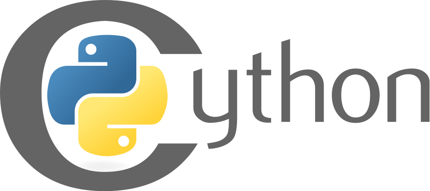
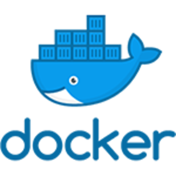

### About me
I am passionate about empowering people around me with technology and digital skills. Since 2013, I have been teaching courses and workshops on web development, software development and data analytics, and mentoring inspiring data scientists and software developers. I currently work as a Data Scientist at [BCG X](https://www.bcg.com/x) where I help our clients grow their business through data science and advanced technology.

In my spare time, I like to read and contribute to open-source software. I am mostly interested in economics, artificial intelligence, human behavior, business, entrepreneurship, management, effective altruism and anything related to maximizing human potential.

###### Connect with me:
[][website]
[][linkedin]
[][email]  

##### Languages

<!--  -->
<!--  -->
<!--  -->

  

##### Tools

  

##### Frameworks

[website]: https://mathijsdejong.info
[company]: https://www.bcg.com/x
[linkedin]: https://linkedin.com/in/mathijsdejong995/
[email]: dejong.mathijs@bcg.com
